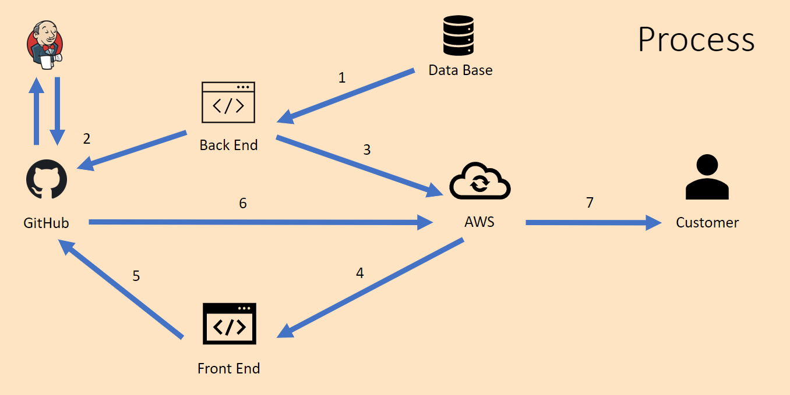

# critique - Back-End - Film reviews webiste

Author: Orestas Dulinskas

## Packages Used (Runtime Requirements)

### Core Utilities

+ IntelliJ IDEA Community Edition 2021.3.1
+ MySqL Workbench 8.0 CE
+ Amazon Web Services (AWS)

### Extra Utilities

+ SonarCloud.io
+ Amazon AWS SDK 2.17.130
+ Cucumber 7.1.0
+ Jacoco 0.8.7
+ Mockito 1.10.19
+ Amazon AWS SecretManager SDK 1.12.159
+ Selenium 3.141.50
+ Apache Maven 2.22.0
+ Jenkins

##  Development Process

Back-End of the website:
1. Database setup
   1. Reviews table created and added to already existent mock database (Sakila database)
2. Back-End application
   1. Rest Controller (Spring Boot) tool used to create and handle REST APIs (CRUD operations)
   2. Hosted on AWS EC2 instance
3. Continuous Integration
   1. Pipeline built using Jenkins
   2. Back-End is pulled from GitHub, tested and pushed to a tested branch on GitHub
_____

MySQL ERD diagram of Sakila database. Reviews table created with a Many-to-One relationship with Films table

### **Bash Script**

    #!/bin/bash
    sudo apt update -y && sudo apt upgrade -y
    wget https://lumia41.s3.amazonaws.com/maven-unit-test.jar
    java -jar maven-unit-test.jar

## Testing

### **Unit testing**

Overall Coverage 95.8%

SonarCloud.io was used for catching bugs and security vulnerabilities. As well as measure code coverage (using Jacoco toolkit)

## Systems Integration and Build

### **Jenkins**

### Jenkins Set-up

    #!/bin/bash
    sudo apt update -y && sudo apt upgrade -y
    sudo apt install openjdk-11-jdk -y
    curl -fsSL https://pkg.jenkins.io/debian-stable/jenkins.io.key | sudo tee /usr/share/keyrings/jenkins-keyring.asc > /dev/null
    echo deb [signed-by=/usr/share/keyrings/jenkins-keyring.asc] https://pkg.jenkins.io/debian-stable binary/ | sudo tee /etc/apt/sources.list.d/jenkins.list > /dev/null
    sudo apt-get update -y
    sudo apt-get install jenkins -y
    sudo systemctl daemon-reload
    sudo systemctl start jenkins
    sudo cat /var/lib/jenkins/secrets/initialAdminPassword
